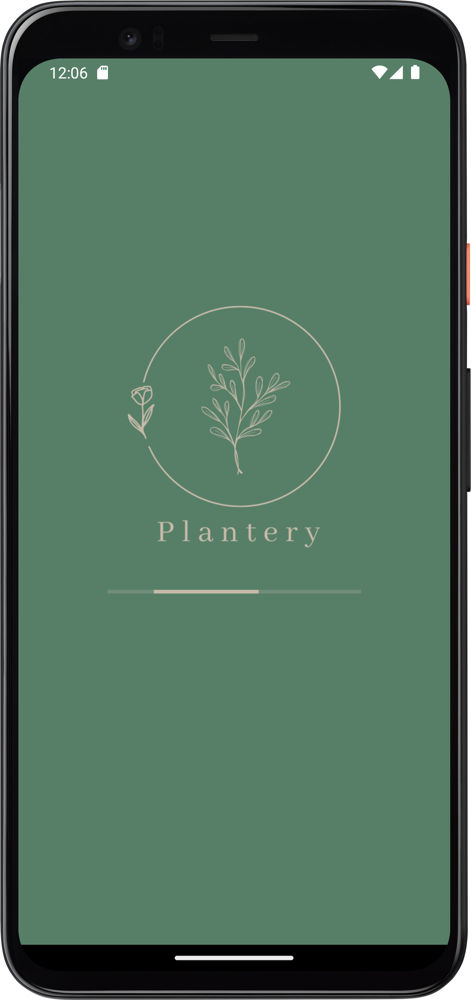
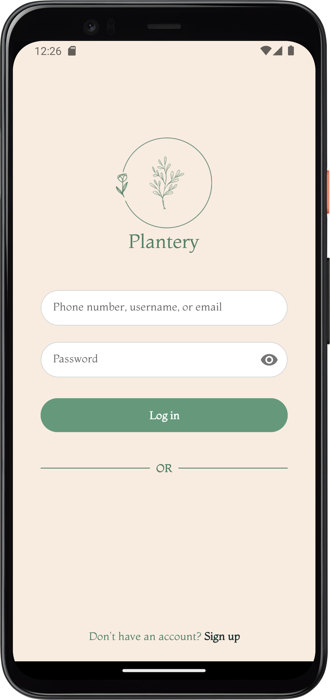
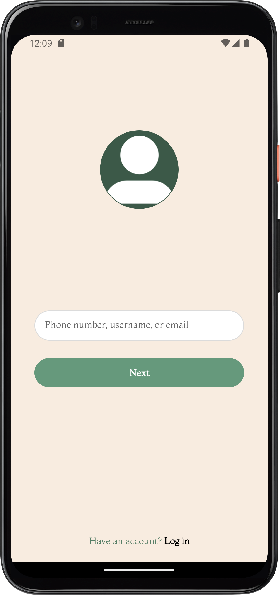
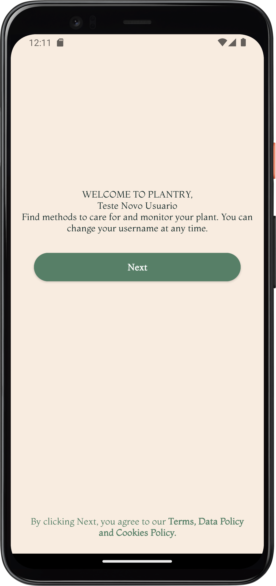
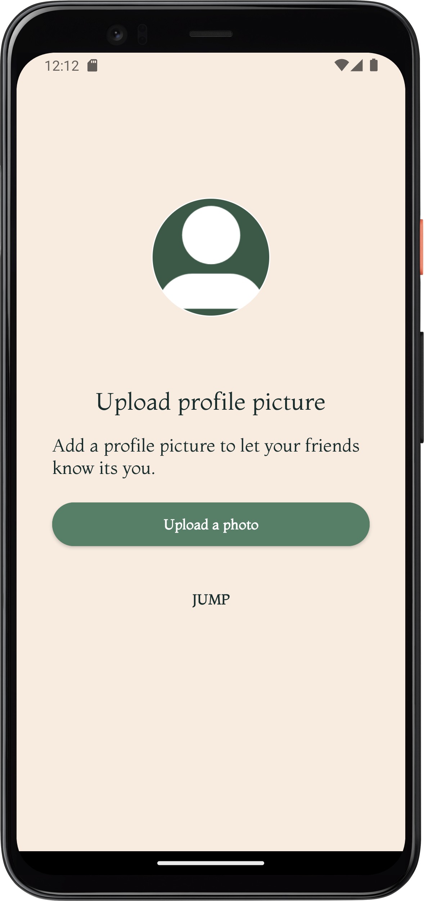

# appPlantery
Plantery will remind you to maintain and help you adjust your hydroponic condition easier. It is connected to your hydroponic device. This app encourages you to grow your own plant amidst your busy life.

### Functionalities
- Manual maintenance (tasks which should be done manually by user)
- Automatic maintenance (setup which you can adjust from your phone)
- Supplies requirements (variables which affect the plants growth)
- and more

## TECHNOLOGIES USED
- ONGOING
- Fragment

  

    
  

  
  
  
  
  
   

## 📜 License

